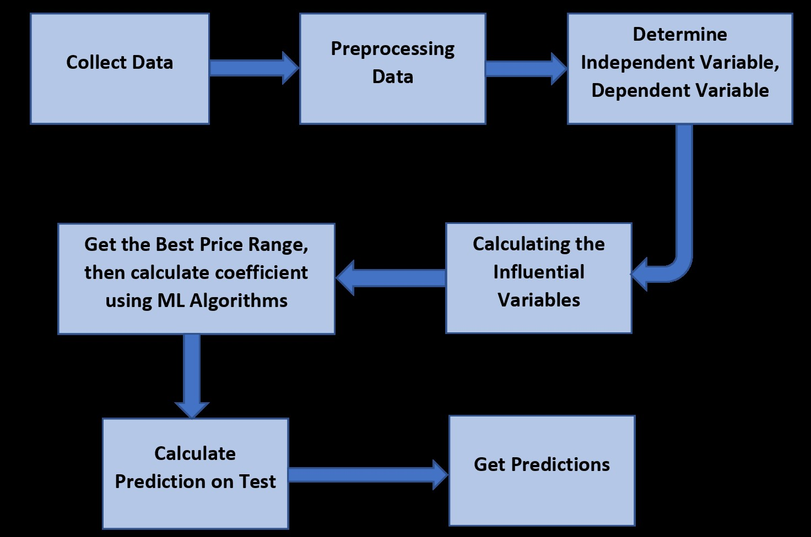
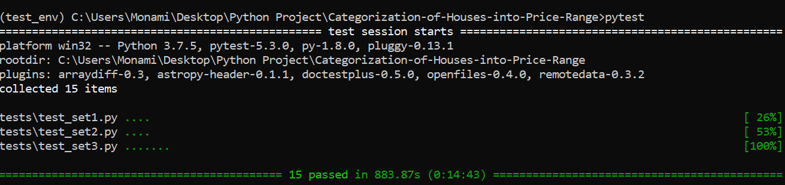

# Categorization-of-Houses-into-Price-Range
Categorization of Houses into Different Price Range using ML Algorithms from American Housing Survey 2017 Dataset

# Abtract:
The main goal of this project is to predict the range of selling price of house with a high degree of predictive accuracy using various Machine Learning methods. Given house sale data or explanatory variable such as number of bedrooms, number of bathrooms in unit, housing cost, annual commuting cost etc, the model is built. Next, the model is evaluated with respect to test data, and plot the prediction and coefficients. 

For my project, I have prepared two types of file for the same code - one .py and other .ipynb. The .py version is for testing using pytest. I am applying different machine learning algorithms and using a big dataset (441 MB). Therefore, my .ipynb file became too large (around 90MB) which cannot be uploaded in github repo as it is. Therefore, I prepared a PDF copy of .ipynb file with all outputs that got generated, so that outputs of program are visible. Also, I cleared all outputs for .ipynb file and uploaded that as well. All the relevant documents along with the .ipynb with all generated outputs is present in google drive - https://drive.google.com/drive/u/0/folders/1Or1xQ5GVPU1sCB3hY7V5pAKYYp-aP2Nd  

# Dataset:
I am using American Housing Survey 2017 data (household.csv in AHS 2017 National PUF v3.0 CSV.zip) https://www.census.gov/programs-surveys/ahs/data.2017.html. Since the dataset is very big, I am just providing the link. It could not be uploaded in github repo. There is another csv file called AHSDICT_15NOV19_21_17_31_97_S.csv that consist of the mapping information of each feature name to their actual meaning and data type information. This file is already present in github repo. In the AHS microdata, the basic unit is an individual housing unit. Each record shows most of the information associated with a specific housing unit or individual, except for data items that could be used to personally identify that housing unit or individual. The dataset comprises of housing data features like TOTROOMS(Number of rooms in unit), UNITSF(Square footage of unit) etc., and target column as MARKETVAL(Current market value of unit) to evaluate model and also check which amongst all features is the most correlated feature for price prediction. 

Two primary datasets used are:  
AHS 2017 Data - https://www.census.gov/programs-surveys/ahs/data.2017.html (household.csv in AHS 2017 National PUF v3.0 CSV.zip) 
AHS Codebook Feature Name Mapping - 

# Pre-requisites:
Python 3.7.0  
Numpy 
Pandas 
Scipy 
Scikit-learn 
Matplotlib 

# Project Implementation:
I defined machine learning models using most of the explanatory variables describing every aspect of residential homes and predict the final price of each home. 

# Algorithms Implemented:
In this project, my aim is to implement algorithms which will be able to learn and classify the new observations to correct house price ranges. I decided to use below machine learning algorithms for the same- 
•	Random Forest (RandomForestClassifier) 
•	K-Nearest Neighbor (KNeighborsClassifier) 
•	Logistic Regression (LogisticRegression) 
•	Decision Tree (DecisionTreeClassifier) 

# Code Execution Details:
Since the input AHS 2017 dataset is very big (around 441 MB), and I am executing four different ML algorithms, the entire code takes 15 minutes (approx..) to execute. I have also prepared 15 test codes for my code, which can be verified using pytest. 

